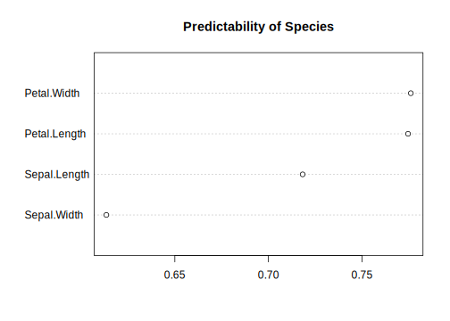

# mudep

<!-- badges: start -->

<!-- badges: end -->

**mudep** is an R package which provides measures based on mutual
dependency, and other related methods for data analysis.

It features a generalized version of (absolute) correlation coefficient
for arbitrary types of data, including categorical variables. Missing
values can also be handled naturally by treating them as observations of
a single categorical value, namely `NA`.

**Note that this project is in an early stage of development, so changes
may occur frequently.**

## Installation

You can install the development version of `mudep` from
[GitHub](https://github.com/) with `pak`:

``` r
# install.packages("pak")
pak::pak("r-suzuki/mudep")
```

or with `devtools`:

``` r
# install.packages("devtools")
devtools::install_github("r-suzuki/mudep")
```

## Example

``` r
library(mudep)
```

**Generalized correlation measure** takes values in $[0,1]$, which can
capture both linear and nonlinear relations.

When the joint distribution of $x,y$ is bivariate normal, its
theoretical value coincides with the absolute value of the correlation
coefficient.

``` r
# Generalized correlation measure
gcor(iris)
#>              Sepal.Length Sepal.Width Petal.Length Petal.Width   Species
#> Sepal.Length    1.0000000   0.6180293    0.8449216   0.8300394 0.8226041
#> Sepal.Width     0.6180293   1.0000000    0.6862189   0.6963419 0.6794982
#> Petal.Length    0.8449216   0.6862189    1.0000000   0.9581278 0.9728947
#> Petal.Width     0.8300394   0.6963419    0.9581278   1.0000000 0.9795837
#> Species         0.8226041   0.6794982    0.9728947   0.9795837 1.0000000
```

With $|r|$ as the generalized correlation between $x$ and $y$, we can
define a dissimilarity measure:

$$
d(x,y) = \sqrt{1 - |r|^2}
$$

It can be applied to cluster analysis:

``` r
# Clustering
gd <- gdis(iris)
hc <- hclust(gd, method = "ward.D2")
plot(hc)
```


Multidimensional scaling would serve as a good example of an
application:

``` r
# Multidimensional scaling
mds <- cmdscale(gd, k = 2)
plot(mds, type = "n", xlab = "", ylab = "", asp = 1, axes = FALSE,
     main = "cmdscale with gdis(iris)")
text(mds[,1], mds[,2], rownames(mds))
```


The **predictability score** is another variation of the generalized
correlation. It also takes values in $[0,1]$, reaching $1$ when $y$ is
perfectly predictable by $x$ (i.e., when the conditional distribution
$f(y \mid x)$ is a one-point distribution) and $0$ when $x$ and $y$ are
independent.

``` r
# Predictability of Species from other variables
ps <- pscore(Species ~ ., data = iris)
dotchart(sort(ps), xlim = c(0, 1), main = "Predictability of Species")
```


